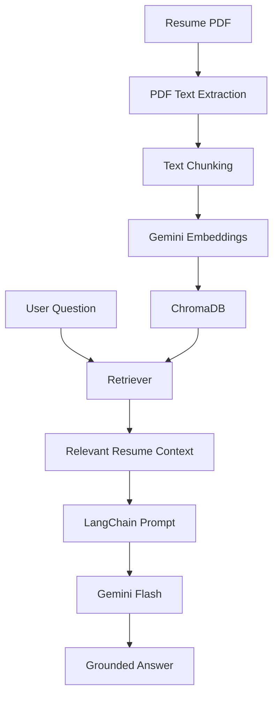

# Resume Q&A Assistant using RAG

## Project Overview

This project builds a practical Resume Q&A Assistant that helps recruiters or hiring managers ask natural-language questions about a candidate's uploaded resume. The app extracts text from a PDF resume, chunks the text, embeds it with Gemini embeddings, stores it in ChromaDB, and uses a LangChain retrieval pipeline plus Gemini Flash to generate grounded answers.

The result is a beginner-friendly example of a real Retrieval-Augmented Generation (RAG) workflow that reduces hallucination by grounding responses only in the resume content.

## Features

- Resume PDF upload
- PDF text extraction
- Text chunking
- Gemini embeddings
- ChromaDB vector search
- LangChain RAG pipeline
- Gemini Flash response generation
- Grounded answers
- Hallucination prevention
- Streamlit UI

## Architecture



## Installation

Create a virtual environment:

```bash
python -m venv venv
```

Activate it on Windows:

```bash
venv\Scripts\activate
```

Install dependencies:

```bash
pip install -r requirements.txt
```

Configure environment variables in a `.env` file:

```env
GOOGLE_API_KEY=your_api_key
GEMINI_MODEL=your_available_gemini_flash_model
EMBEDDING_MODEL=models/gemini-embedding-001
CHUNK_SIZE=800
CHUNK_OVERLAP=150
TOP_K=4
```

Run the app:

```bash
streamlit run app.py
```

## How RAG Works

```text
Document
   ↓
Chunking
   ↓
Embedding
   ↓
Vector Store
   ↓
Similarity Search
   ↓
Relevant Context
   ↓
LLM
   ↓
Grounded Answer
```

The system first extracts text from the uploaded resume, splits it into chunks, embeds those chunks, and stores them in ChromaDB. When a user asks a question, the retriever finds similar chunks, and Gemini uses only that retrieved context to generate a factual response.

## Technologies

- Python: used for the application logic and modular architecture.
- Gemini: provides the embedding and LLM capabilities for the app.
- LangChain: orchestrates prompts, retrieval, and LLM invocation.
- ChromaDB: stores the vectorized resume chunks and powers semantic search.
- RAG: combines retrieval and generation to ground answers in the uploaded document.
- Embeddings: convert text chunks into vectors for semantic similarity matching.
- Streamlit: provides the web interface for uploading resumes and asking questions.

## Project Structure

```text
resume_qa_assistant/
├── app.py
├── .env
├── .gitignore
├── requirements.txt
├── README.md
├── data/
│   └── sample_resume.pdf
└── src/
    ├── __init__.py
    ├── config.py
    ├── pdf_processor.py
    ├── embeddings.py
    ├── vector_store.py
    ├── rag_chain.py
    └── __init__.py
```

## Notes

- Keep the Google API key in `.env` and never commit it to version control.
- The app is designed to answer only from the uploaded resume and to refuse unsupported inferences.
- For a production environment, you would also add monitoring, caching, and better PDF parsing safeguards.
